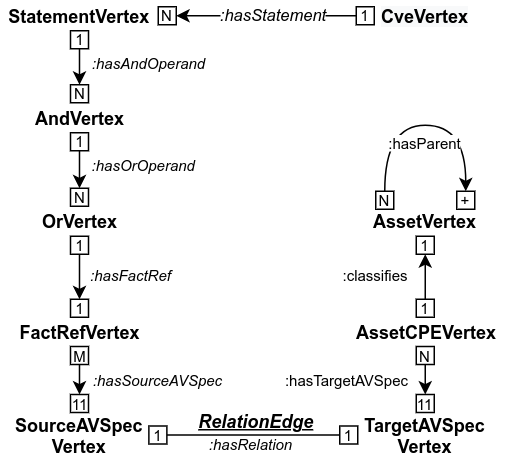

# Graph-Based CPE Matching for Identification of Vulnerable Asset Configurations

This is an experimental implementation of a graph-based approach for identification of vulnerable asset configurations via Common Platform Enumeration matching. The approach consists of a graph model and insertion procedure that is able to represent and store information about CVE vulnerabilities and different configurations of CPE-classified asset components. These building blocks are accompanied with a search query in Gremlin graph traversal language that is able to find all vulnerable pairs of CVEs and asset configurations in a single traversal, as opposed to a conventional brute-force approach.

## Requirements

* Java 11
* Apache Maven

OR

* Docker

## Technology Stack

* Gremlin-Java and Apache Tinkerpop (https://tinkerpop.apache.org/docs/3.4.6/)
* Ferma Object Graph Mapping (http://syncleus.com/Ferma/)
* CPE 2.3 Reference Implementation (https://pages.nist.gov/cpe-reference-implementation/)
* NVD JSON 1.1 Vulnerability Feed Schema for code generation (https://nvd.nist.gov/General/News/JSON-1-1-Vulnerability-Feed-Release)
* JanusGraph (https://janusgraph.org/)

## Important Classes

### `src/main/java`

* `cz.muni.csirt.ogm.vertex.*` defines all the vertices and their insertion logic.
* `cz.muni.csirt.matching.CpeGraphMatcher` implements the search traversal in Gremlin.
* `cz.muni.csirt.nvd.cpe.transform.statement.StatementUtil` implements the conversion of applicability statements to CNF.
* `cz.muni.csirt.nvd.cpe.transform.wfn.StringRangeUtil` implements support for version ranges for NVD-extended CPE names.

### `src/main/java`

* `cz.muni.csirt.matching.CVEGraphMatchingTest` executes tests for TinkerGraph.
* `cz.muni.csirt.matching.CVEJanusGraphMatchingTest` executes tests for JanusGraph.

## How to Try

All the core functionality is tested via unit tests. In order to run tests you can either use:

* `mvn test`

OR

* `docker build -t csirtmu/orion-graph-cpe-matching .`
* `docker run -it csirtmu/orion-graph-cpe-matching mvn test`

## Graph Model



## Pseudo-Code

### `CveVertex` Insertion

```python
def CveVertex(uid, cve):  # uid = cve.id
    v = G.createScopedV(uid, cve, "CveVertex")
    for statement in cve.configurations:
        asCNF = convertToCNF(createBooleanFormula(statement))
        v.newLinkOut('hasStatement', StatementVertex(asCNF))
    return v

def StatementVertex(asCNF):
    c = G.createUnscopedV(asCNF, "StatementVertex")
    for andOperand in asCNF.andOperands:
        c.newLinkOut('hasAndOperand', AndVertex(andOperand))
    return c

def AndVertex(andOperand):
    a = G.createUnscopedV(andOperand, "AndVertex")
    for orOperand in andOperand.orOperands:
        a.newLinkOut('hasOrOperand', OrVertex(orOperand))
    return a

def OrVertex(orOperand):
    o = G.createUnscopedV(orOperand, "OrVertex")
    o.setLinkOut('hasFactRef', FRefVertex(orOperand.factRef))
    return o

def FRefVertex(factRef):
    r = G.createUnscopedV(factRef, "FactRefVertex")
    avPairs = getAVPairs(getWFN(factRef.cpeName))
    for avp in avPairs:
        uid = (avp.name, avp.val)
        p = G.getIfExistsV(uid, "SourceAVSpecVertex") \
            .else_(SourceAVSpecVertex(uid, avp))
        r.newLinkOut('hasSourceAVSpec', p)
    return r

def SourceAVSpecVertex(uid, avp):  # uid = (avp.name, avp.val)
    s = G.createScopedV(uid, avp, "SourceAVSpecVertex")
    tgts = G.findV("attribute", avp.name, "TargetAVSpe...")
    for t in tgts:
        e = s.newLinkBoth('hasRelation', t, "RelationEdge")
        e.setRelationType(compareAVPair(s.avp, t.avp))
    return s
```

### `AssetVertex` Insertion

```python
def AssetVertex(uid, asset):  # uid = asset.uuid
    a = G.createScopedV(uid, asset, "AssetVertex")
    if asset.parentUUID:
        p = G.getV(asset.parentUUID, "AssetVertex")
        if p: a.setLinkOut('hasParent', p)
    aw = getWFN(asset.cpeName)
    a.newLinkIn('classifies', AssetCpeVertex(aw))
    return a

def AssetCpeVertex(aw):
    x = G.createUnscopedV(aw, "AssetCPEVertex")
    avPairs = getAVPairs(aw)
    for avp in avPairs:
        uid = (avp.name, avp.val)
        p = G.getIfExistsV(uid, "TargetAVSpecVertex") \
            .else_(TargetAVSpecVertex(uid, avp))
        x.newLinkOut('hasTargetAVSpec', p)
    return x

def TargetAVSpecVertex(uid, avp): # uid = (avp.name, avp.val)
    t = G.createScopedV(uid, avp, "TargetAVSpecVertex")
    srcs = G.findV("attribute", avp.name, 'SourceAVSpe...')
    for s in srcs:
        e = t.newLinkBoth('hasRelation', s, 'RelationEdge')
        e.setRelationType(compareAVPair(s.avp, t.avp))
    return t
```

### Search Traversal Query 

```python
QUERY = g.V()
.hasLabel("type::CveVertex").hasId(P1).as_("x_Cve")
.out("hasStatement").as_("x_Statement")
.out("hasAndOperand").out("hasOrOperand").as_("x_Or")
.choose(has_("negate", False), T1, T2).as_("x_AssetCPE")
.dedup("x_FactRef", "x_AssetCPE")
.out("classifies").optional(Z).hasId(P2).as_("x_RootAsset")
.group()
	.by(select("x_Cve", "x_Statement", "x_RootAsset"))
	.by(select("x_Or", "x_FactRef", "x_AssetCPE").fold())
.unfold()
.project("match", "path", "expectedCount", "actualCount")
	.by(select(Column.keys)).by(select(Column.values))
	.by(C1).by(C2)
.where("expectedCount", P.eq("actualCount"))
```

### Helper Traversals

```python
P1 = P.without([]) # or P.eq(<someCveId>)
P2 = P.without([]) # or P.eq(<someAssetUUID>)
RL = [SUPERSET, EQUALS] # desired AV pair match

M[] = CPE_ATTR_NAMES.forEachElement(_X -> # 11 WFN attributes
__.as_("x_FactRef").out("hasSourceAVSpec").has_("attrName", _X)
.bothE("hasRelation").has_("relation", P.within(RL))
.outV().in_("hasTargetAVSpec").as_("x_Same_AssetCPE")).toArr()

T1 = __.out("hasFactRef") # negate = False
.match([traverse(p) for p in M]).select("x_Same_AssetCPE")

T2 = __.out("hasFactRef").as_("x_FactRef") # negate = True
.out("hasSourceAVSpec").bothE("hasRelation")
.has_("relation", P.without(RL)).outV().in_("hasTargetAVSpec")

Z = __.repeat(out("hasParent"))
.until(outE("hasParent").count().is_(0))

C1 = __.select(Column.keys).select("x_Statement")
.out("hasAndOperand").count()

C2 = __.select(Column.values).unfold().select("x_Or")
.dedup().in_("hasOrOperand").dedup().count()
```


